# Analysis of Chulwalar Exports of Blue Etel
Johnny Quick  
July 23, 2016  

##**Introduction** 

Analyze the Chulwalar exports of Blue Etel by reviewing various forecast models, determining the forecast model with the best fit, and determining how well the forecast model meets the planned exports.

###**Setting environment**

  * Load necessary packages and set directories
  * Code can be found in appendix


###**Load and clean data**

  * The following files should be in "ForecastChulwalarExportsOfBlueEtel/Data" directory
  * Load file ImportedAsIsDataChulwalar.csv
  * Load file ImportedPlanDataChulwalar.csv
  * Load file ImportedIndicatorsChulwalar.csv
  * Place Blue Etel As Is and Plan data into Time Series


###**Analyze data**

####**Correlation between As Is and Plan Data**
##### Test the correlation between As Is and Plan data in order to test how exact the planning is. Correlation is a measure of linear relationship between two variables. 


```
## [1] 0.8044146
```

##### The results show a very high planning accuracy at 80% correlation.
<br/>

#### Let's look at the Seasonal and Trend decomposition using Loess (STL)
This helps us determine which forecast model to use later.

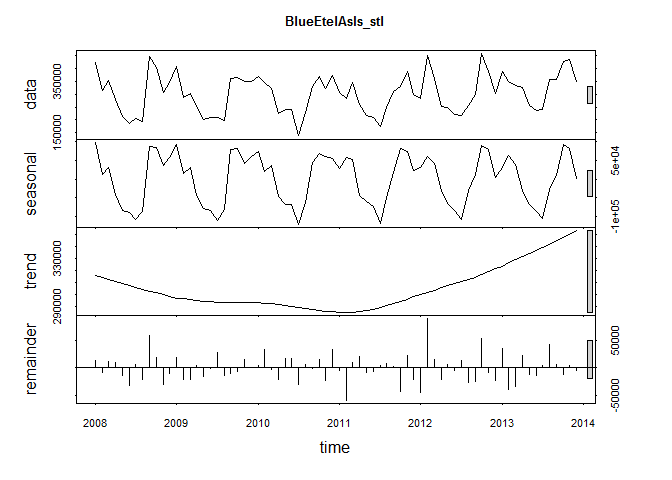<!-- -->

We have a lot of seasonality here, and some trending. It trends down for the first few, and then upward from 2011 on.

## Correlation with external indicators

The indicators are as follows:

* Monthly Change in Export Price Index (CEPI)
* Monthly Satisfaction Index (SI) government based data
* Average monthly temperatures in Chulwalar
* Monthly births in Chulwalar
* Monthly Satisfaction Index (SI) external index 
* Yearly Exports from Urbano
* Yearly number of Globalisation Party members in Chulwalar
* Monthly Average Export Price Index for Chulwalar
* Monthly Producer Price Index (PPI) for Etel in Chulwalar
* National Holidays
* Chulwalar Index (Total value of all companies in Chulwalar)
* Monthly Inflation rate in Chulwalar
*	Proposed spending for National Holidays
* Influence of National Holiday

The indicators will be converted into individual  vectors and subsequently converted into time series. The correlation of the indicators will then be tested against the As Is exports for Chulwalar.
<br/>

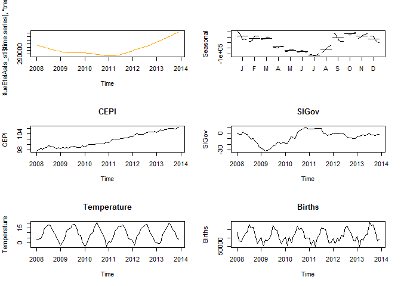<!-- --><!-- --><!-- -->

##**Plot analysis**

* The first plot shows the trend breakout for the Blue Etel. It trends down for the first few, and then upward from 2011 on
* The next plot shows the monthly trends for the Blue Etel
* There is a continual linear trend upward in the Change in Export Price Index (CEPI)
* The monthly satisfaction index trended downward until 2009, and then upward until close to 2012, downward for a bit, and then relatively flat
* The temperature has much seasonality
* The births have much seasonality with a trend upward at the end 
* The monthly satisfaction external index shows an exponential trend upward
* The yearly exports from Urbano show a stair stepping trend
* The globalisation party members show a stair stepping trend
* There is an exponential trend upwards for the monthly average export price index for Chulwalar
* There is a lot of seasonality and some upward trending for the monthly producer price index for Etel in Chulwalar
* There is a lot of seasonality in the national holidays
* There is some seasonality and a good amount of trending (first downward and then continually upward) in the Chulwalar index (the toal value of all companies in Chulwalar)
* There is some slight seasonality, and trending downward at first, then upward, before being relatively flat in the monthly inflation rate in Chulwalar 
* The trend was relatively flat at first, then downward and flat, then trending upward at the end and then flattening again in Independence Day presents
* There is a lot of seasonality in the influence of national holidays

##**Correlation analysis**

* There is a small negative correlation between the Blue Etel and the monthly satisfaction index at -4%
* There is a large negative correlation between the Blue Etel and the temperature at -64%
* There is a relatively small correlation between the Blue Etel and births at -28%. 
* There is a relative small positive correlation between the Blue Etel and the external monthly satisfaction index at 16%
* There is a relative small positive correlation between the Blue Etel and the yearly exports from Urbano at 17%
* There is a very small positive correlation between the Blue Etel and the number of globalisation party members at 9%
* There is a relative small positive correlation between the Blue Eteal and the monthly average export price index for Chulwalar
* There is a relatively small positive correlation between the Blue Etel and the monthly producer price index for Etel in Chulwalar
* There is a relatively small positive correlation between the Blue Etel and the national holidays
* There is a relatively small positive correlation between the Blue Etel and the Chulwalar index
* There is virually no correlation (2%) between the Blue Etel and the monthly inflation rate in Chulwalar
* There is a relatively small positive correlation between the Blue Etel and Independence Day presents. 
* There is a relatively small positive correlation between the Blue Etel and the influence of national holidays at 28%

##**Forecast graphs**

<!-- -->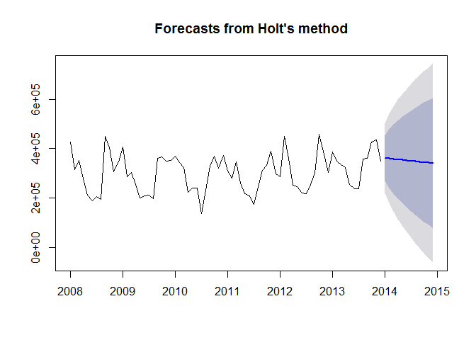<!-- -->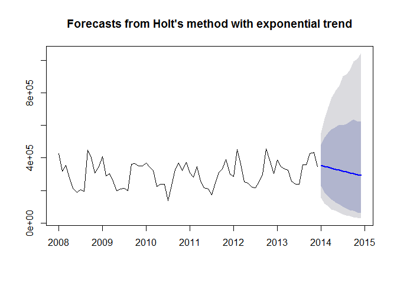<!-- --><!-- -->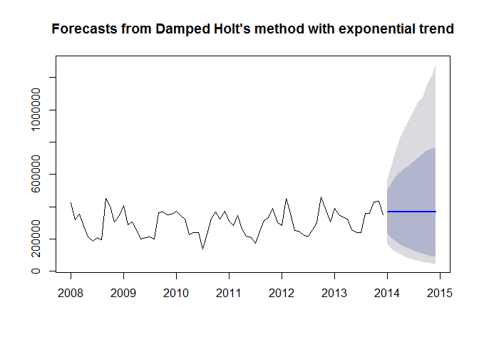<!-- -->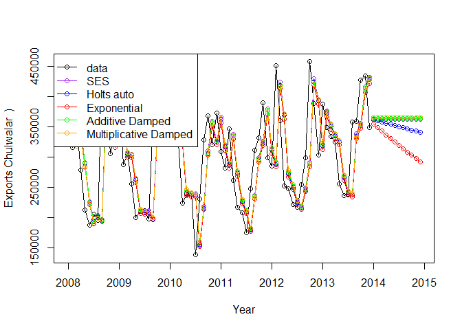<!-- -->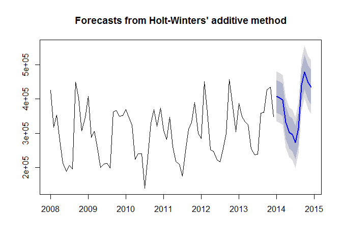<!-- --><!-- -->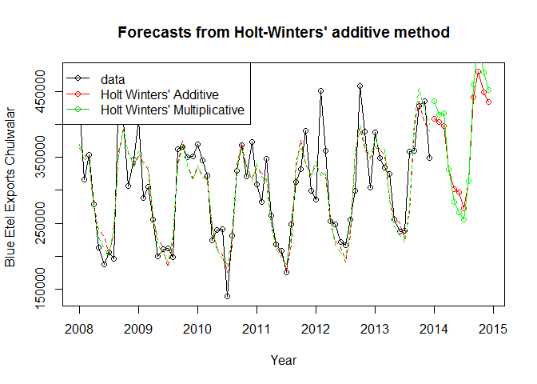<!-- -->

##**Forecast analysis**

* In the Simple Exponential Smoothing forecast, the forecast is flat using the quantity from the last period in the time series
* In the first Holt method, the forecast trends slightly downward
* In the second Holt method, the forecast trends downward at a greater rate than the first Holt method because this is an exponential forecast
* In the first damped Holt method, the forecast is pretty flat from the last point in the time series
* In the second damped Holt method, the forecast trends slightly downward from the last point in the timer series
* The next plot shows all the forecasts from SES and Holt together
* The Holt Winters additive model forecast shows the forecast has seasonality and some trending up and down
* The Holt Winters multiplicative model forecast shows the forecast has seasonality and some trending up and down. It looks very close to the Holt Winters additive model
* The last plot shows both Holt Winters models together. We can see here again that both models are very close to one another
<br/>

##**Check forecast measurements to determine best fit**
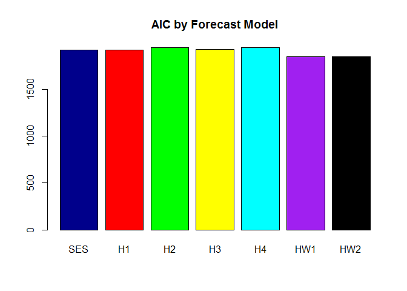<!-- -->

```
## As we can see, the Holt Winters 2 model (multiplicative) is slightly better 
## than the rest because the AIC is slightly lower than the Holt Winters 1 model 
## (additive) and lower than all the others models as well.
```

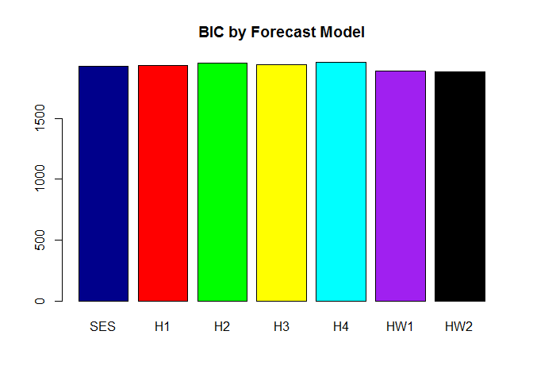<!-- -->

```
## As we can see, the Holt Winters 2 model (multiplicative) is slightly better
## than the rest because the BIC is slightly lower than the Holt Winters 1 model 
## (additive) and lower than all the others models as well.
```

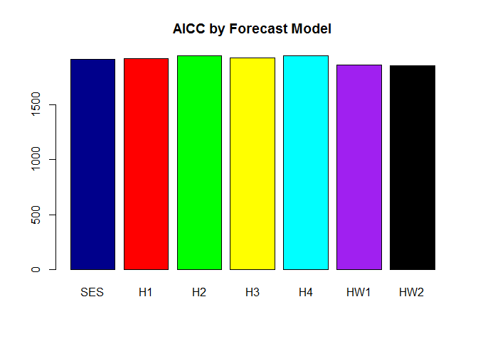<!-- -->

```
## As we can see, the Holt Winters 2 model (multiplicative) is slightly better
## than the rest because the AICC is slightly lower than the Holt Winters 1 model 
## (additive) and lower than all the others models as well.
```

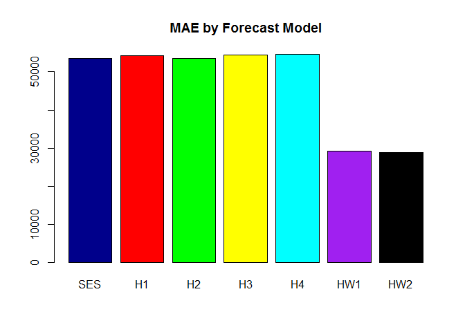<!-- -->

```
## As we can see, the Holt Winters 2 model (multiplicative) is slightly better
## than the rest because the MAE is slightly lower than the Holt Winters 1 model 
## (additive) and lower than all the others models as well.
```

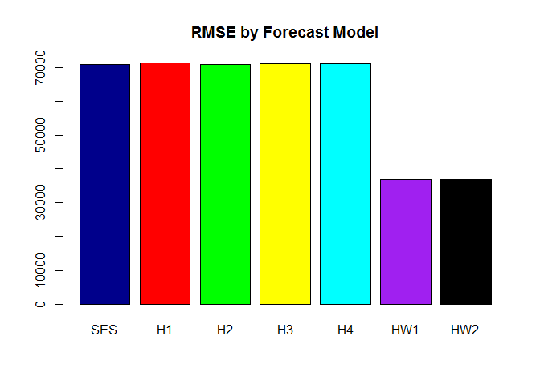<!-- -->

```
## As we can see, the Holt Winters 2 model (multiplicative) is slightly better
## than the rest because the RMSE is slightly lower than the Holt Winters 1 model 
## (additive) and lower than all the others models as well.
```

Forecast measurement terms:

* AIC - Akaike's Information Criterion
* AICC - Akaike's Information Criterion Corrected (for small sample bias)
* BIC - Schwartz' Bayesian Information Criterion
* MAE - Mean Absolute Error
* RMSE - Root Mean Squared Error
<br/>

I choose the Holt Winters multiplicative model because it's numbers for AIC, AICC, BIC, MAE, and RMSE are slightly lower than the Holt Winters additive model, and much lower than the rest of the models indicating this is the best model fit.

### Check how accurate the forecast is to the as is data for 2014

```r
cor(Model_hw_2_PointForecast, TotalAsIs_2014)
```

```
## [1] 0.8611788
```

There is an 86% correlation between the Holt Winters multiplicative forecast model for the Blue Etel and the Total As Is for 2014, which makes it very accurate.

##**Appendix**

#### **session info**

R version 3.3.1 (2016-06-21)
Platform: x86_64-w64-mingw32/x64 (64-bit)
Running under: Windows >= 8 x64 (build 9200)

locale:
[1] LC_COLLATE=English_United States.1252  LC_CTYPE=English_United States.1252   
[3] LC_MONETARY=English_United States.1252 LC_NUMERIC=C                          
[5] LC_TIME=English_United States.1252    

attached base packages:
[1] stats     graphics  grDevices utils     datasets  methods   base     

other attached packages:
[1] fpp_0.5           lmtest_0.9-34     expsmooth_2.3     fma_2.2          
[5] tseries_0.10-35   forecast_7.1      timeDate_3012.100 zoo_1.7-12       

loaded via a namespace (and not attached):
 [1] Rcpp_0.12.5      knitr_1.12.3     munsell_0.4.3    colorspace_1.2-6
 [5] lattice_0.20-33  quadprog_1.5-5   plyr_1.8.4       tools_3.3.1     
 [9] nnet_7.3-12      parallel_3.3.1   grid_3.3.1       gtable_0.2.0    
[13] htmltools_0.3.5  yaml_2.1.13      digest_0.6.9     ggplot2_2.1.0   
[17] rmarkdown_0.9.6  fracdiff_1.4-2   scales_0.4.0 

Code chunks

###**Setting environment**

```r
## Set directory variables
## main directory
require(fpp)
require(forecast)
maind <- "/ForecastChulwalarExportsOfBlueEtel"
## data directory
datad <- paste(maind, "DATA", sep = "/")
## analysis directory
analysisd <- paste(maind, "ANALYSIS", sep = "/")
```

###**Load the data**

```r
# Code is from LoadData.R
## Set directory variables
## main directory
maind <- "ForecastChulwalarExportsOfBlueEtel"

## data directory
datad <- paste(maind, "DATA", sep = "/")

## analysis directory
analysisd <- paste(maind, "ANALYSIS", sep = "/")

## set working directory to data directory
setwd(datad)

#These data files must be present in the data subdirectory
ImportedAsIsData <- read.csv(file="ImportedAsIsDataChulwalar.csv", header = F, sep=";", fill = T) 
ImportedPlanData <- read.csv(file="ImportedPlanDataChulwalar.csv", header = F, sep=";", fill = T) 
ImportedIndicators <- read.csv(file="ImportedIndicatorsChulwalar.csv", header = F, sep=";", fill = T)
str(ImportedAsIsData)
str(ImportedPlanData)
str(ImportedIndicators)
```

###**Clean the data**

```r
# Code is from CleanData.R
## Set directory variables
## main directory
maind <- "ForecastChulwalarExportsOfBlueEtel"

## data directory
datad <- paste(maind, "DATA", sep = "/")

## analysis directory
analysisd <- paste(maind, "ANALYSIS", sep = "/")

## set working directory to data directory
setwd(datad)

#  Transform data into time series
# In order to be able to work with the partial data sets later, these need to be split into individual vectors and converted into times series.

BlueEtelAsIsVector <- c(ImportedAsIsData [58:69,2],ImportedAsIsData [58:69,3],ImportedAsIsData [58:69,4],ImportedAsIsData [58:69,5],ImportedAsIsData [58:69,6],ImportedAsIsData [58:69,7])

BlueEtelPlanVector <- c(ImportedPlanData[58:69,2],ImportedPlanData[58:69,3],ImportedPlanData[58:69,4],ImportedPlanData[58:69,5],ImportedPlanData[58:69,6],ImportedPlanData[58:69,7])

# The data is saved as a vector and needs to be converted into a time series
BlueEtelAsIs <- ts(BlueEtelAsIsVector, start=c(2008,1), end=c(2013,12), frequency=12)

BlueEtelPlan <- ts(BlueEtelPlanVector, start=c(2008,1), end=c(2013,12), frequency=12)

# Get total as is for 2014 for forecast comparison
TotalAsIsVector_2014 <- c(ImportedAsIsData[2:13,8])
TotalAsIs_2014 <- ts(TotalAsIsVector_2014, start=c(2014,1), end=c(2014,12), frequency=12)

# Call up the time series to check everything has worked.

str(BlueEtelAsIs)
str(BlueEtelPlan)
```

###**Analyze the data to ensure vectors are setup correctly**

```r
# Code is from AnalyzeDataChecks.R
# Check that the data import has worked

str(CEPIVector)
str(SIGovVector)  
str(TemperatureVector) 
str(BirthsVector)
str(SIExternVector)
str(UrbanoExportsVector) 
str(GlobalisationPartyMembersVector)
str(AEPIVector) 
str(PPIEtelVector) 
str(NationalHolidaysVector) 
str(ChulwalarIndexVector)
str(InflationVector) 
str(IndependenceDayPresentsVector)
```

###**Seasonal and Trend decomposition using Loess (STL)**

```r
# Code is from AnalyzeData1.R
require(fpp)
require(forecast)
# Basic data analysis

BlueEtelAsIs_lm <- lm(BlueEtelAsIs ~ BlueEtelPlan , data = BlueEtelAsIs)
summary(BlueEtelAsIs_lm)

BlueEtelAsIs_tslm <- tslm(BlueEtelAsIs ~ BlueEtelPlan )
summary(BlueEtelAsIs_tslm)

## Use STL function for decomposition
# The time series can be analysed using the stl function in order to seperate the trend, seasonality and remainder (remaining coincidential) components from one another.

BlueEtelAsIs_stl <- stl(BlueEtelAsIs , s.window=5)

# Now the individual time series can be shown graphically and tabularly. 
# The trend of the blue etel exports is almost linear. 
# A relatively uniform seaonality can be seen.

par(mfrow=c(3,2))
plot(BlueEtelAsIs_stl, col="black", main="BlueEtelAsIs_stl")
```

###**Indicator plots**

```r
# Code is from AnalyzeData2.R

require(fpp)
require(forecast)
# Basic data analysis

par(mfrow=c(3,2))
plot(BlueEtelAsIs_stl$time.series[,"trend"], col="orange")

## Modify seasonal component to a monthly base
# The modification of the seasonlity component can also be changed 
# into a monthly view. It only makes sense to do this if the seasonality 
# component as the trend looks almost identical and the remainder is then 
# randomly spread.

monthplot(BlueEtelAsIs_stl$time.series[,"seasonal"], main="", ylab="Seasonal")

## Correlation with external indicators

#The indicators will be converted into individual  vectors and subsequently converted into time series. The correlation of the indicators will then be tested against the As Is exports for Chulwalar. 

# Monthly Change in Export Price Index (CEPI)

CEPIVector <- c(ImportedIndicators[2:13,2],ImportedIndicators[2:13,3],ImportedIndicators[2:13,4],ImportedIndicators[2:13,5],ImportedIndicators[2:13,6],ImportedIndicators[2:13,7])
CEPI <- ts(CEPIVector , start=c(2008,1), end=c(2013,12), frequency=12)
plot(CEPI, main="CEPI")

# Monthly Satisfaction Index (SI) government based data

SIGovVector <- c(ImportedIndicators[16:27,2],ImportedIndicators[16:27,3],ImportedIndicators[16:27,4],ImportedIndicators[16:27,5],ImportedIndicators[16:27,6],ImportedIndicators[16:27,7])
SIGov <- ts(SIGovVector , start=c(2008,1), end=c(2013,12), frequency=12)
plot(SIGov, main="SIGov")

# Average monthly temperatures in Chulwalar

TemperatureVector <- c(ImportedIndicators[30:41,2],ImportedIndicators[30:41,3],ImportedIndicators[30:41,4],ImportedIndicators[30:41,5],ImportedIndicators[30:41,6],ImportedIndicators[30:41,7])
Temperature <- ts(TemperatureVector, start=c(2008,1), end=c(2013,12), frequency=12)
plot(Temperature, main="Temperature")

# Monthly births in Chulwalar 

BirthsVector <- c(ImportedIndicators[44:55,2],ImportedIndicators[44:55,3],ImportedIndicators[44:55,4],ImportedIndicators[44:55,5],ImportedIndicators[44:55,6],ImportedIndicators[44:55,7])
Births <- ts(BirthsVector, start=c(2008,1), end=c(2013,12), frequency=12)
plot(Births, main="Births")

# Monthly Satisfaction Index (SI) external index 

SIExternVector <- c(ImportedIndicators[58:69,2],ImportedIndicators[58:69,3],ImportedIndicators[58:69,4],ImportedIndicators[58:69,5],ImportedIndicators[58:69,6],ImportedIndicators[58:69,7])
SIExtern <- ts(SIExternVector, start=c(2008,1), end=c(2013,12), frequency=12)
plot(SIExtern, main="SIExtern")

# Yearly exports from Urbano

UrbanoExportsVector <- c(ImportedIndicators[72:83,2],ImportedIndicators[72:83,3],ImportedIndicators[72:83,4],ImportedIndicators[72:83,5],ImportedIndicators[72:83,6],ImportedIndicators[72:83,7])
UrbanoExports <- ts(UrbanoExportsVector, start=c(2008,1), end=c(2013,12), frequency=12)
plot(UrbanoExports, main="UrbanoExports")

# Yearly number of Globalisation Party members in Chulwalar

GlobalisationPartyMembersVector <- c(ImportedIndicators[86:97,2],ImportedIndicators[86:97,3],ImportedIndicators[86:97,4],ImportedIndicators[86:97,5],ImportedIndicators[86:97,6],ImportedIndicators[86:97,7])
GlobalisationPartyMembers <- ts(GlobalisationPartyMembersVector, start=c(2008,1), end=c(2013,12), frequency=12)
plot(GlobalisationPartyMembers, main="GlobalisationPartyMembers")

# Monthly Average Export Price Index for Chulwalar

AEPIVector <- c(ImportedIndicators[100:111,2],ImportedIndicators[100:111,3],ImportedIndicators[100:111,4],ImportedIndicators[100:111,5],ImportedIndicators[100:111,6],ImportedIndicators[100:111,7])
AEPI <- ts(AEPIVector, start=c(2008,1), end=c(2013,12), frequency=12)
plot(AEPI, main="AEPI")

# Monthly Producer Price Index (PPI) for Etel in Chulwalar

PPIEtelVector <- c(ImportedIndicators[114:125,2],ImportedIndicators[114:125,3],ImportedIndicators[114:125,4],ImportedIndicators[114:125,5],ImportedIndicators[114:125,6],ImportedIndicators[114:125,7])
PPIEtel <- ts(PPIEtelVector, start=c(2008,1), end=c(2013,12), frequency=12)
plot(PPIEtel, main="PPIEtel")

# National Holidays

NationalHolidaysVector <- c(ImportedIndicators[170:181,2],ImportedIndicators[170:181,3],ImportedIndicators[170:181,4],ImportedIndicators[170:181,5],ImportedIndicators[170:181,6],ImportedIndicators[170:181,7])
NationalHolidays <- ts(NationalHolidaysVector, start=c(2008,1), end=c(2013,12), frequency=12)
plot(NationalHolidays, main="NationalHolidays")

# Chulwalar Index (Total value of all companies in Chulwalar)

ChulwalarIndexVector <- c(ImportedIndicators[128:139,2],ImportedIndicators[128:139,3],ImportedIndicators[128:139,4],ImportedIndicators[128:139,5],ImportedIndicators[128:139,6],ImportedIndicators[128:139,7])
ChulwalarIndex <- ts(ChulwalarIndexVector, start=c(2008,1), end=c(2013,12), frequency=12)
plot(ChulwalarIndex, main="ChulwalarIndex")

# Monthly Inflation rate in Chulwalar 

InflationVector <- c(ImportedIndicators[142:153,2],ImportedIndicators[142:153,3],ImportedIndicators[142:153,4],ImportedIndicators[142:153,5],ImportedIndicators[142:153,6],ImportedIndicators[142:153,7])
Inflation <- ts(InflationVector, start=c(2008,1), end=c(2013,12), frequency=12)
plot(Inflation, main="Inflation")

# Proposed spending for Independence day presents

IndependenceDayPresentsVector <- c(ImportedIndicators[156:167,2],ImportedIndicators[156:167,3],ImportedIndicators[156:167,4],ImportedIndicators[156:167,5],ImportedIndicators[156:167,6],ImportedIndicators[156:167,7])
IndependenceDayPresents <- ts(IndependenceDayPresentsVector, start=c(2008,1), end=c(2013,12), frequency=12)
plot(IndependenceDayPresents, main="IndependenceDayPresents")

# Influence of National Holidays :
# This indicator is an experiment where the influence of National Holidays is extended into the months leading up to the holiday. However later tests show that this indicator is no better for forecasting than the orignial National Holidays indicator.  

InfluenceNationalHolidaysVector <- c(ImportedIndicators[184:195,2],ImportedIndicators[184:195,3],ImportedIndicators[184:195,4],ImportedIndicators[184:195,5],ImportedIndicators[184:195,6],ImportedIndicators[184:195,7])
InfluenceNationalHolidays <- ts(InfluenceNationalHolidaysVector, start=c(2008,1), end=c(2013,12), frequency=12)
plot(InfluenceNationalHolidays, main="InfluenceNationalHolidays")
```

###**Forecast graphs**

```r
# Code is form Forecast.R
# Forecasting models with smoothing and related approaches
# Exponential Smoothing uses past values to calculate a forecast. The strength with which each value influences the forecast is weakened with help of a smoothing parameter. Thus we are dealing with a weighted average, whose values fade out the longer ago they were in the past.

# The Akaike's Information Criterion(AIC/AICc) or the Bayesian Information Criterion (BIC) should be at minimum.

## Simple expontential smoothing    
Model_ses <- ses(BlueEtelAsIs, h=12)
plot(Model_ses, plot.conf=FALSE, ylab="Exports Chulwalar  )", xlab="Year", fcol="white", type="o")
lines(fitted(Model_ses), col="green", type="o")
lines(Model_ses$mean, col="blue", type="o")
legend("topleft",lty=1, col=c(1,"green"), c("data", expression(alpha == 0.83)),pch=1)

## Holt's linear trend method   
# Holt added to the model in order to forecast using trends as well. For this it is necessary to add a beta, which determines the trend. If neither alpha nor beta is stated, both parameters will be optimised using ets(). The trend is exponential if the intercepts(level) and the gradient (slope) are multiplied with eachother. The values are worse. As the Beta was very low in the optimisation, the forecast is very similar to the ses() model. 

Model_holt_1 <- holt(BlueEtelAsIs,h=12)
plot(Model_holt_1)

# expoential trend
Model_holt_2<- holt(BlueEtelAsIs, exponential=TRUE,h=12)
plot(Model_holt_2)

## Dampened trends
# As such simple trends tend to forecast the future to positively, we have added a dampener. This also works for exponential trends. We also plot the level and slope individually for each model.

Model_holt_3 <- holt(BlueEtelAsIs, damped=TRUE,h=12)
plot(Model_holt_3)

Model_holt_4 <- holt(BlueEtelAsIs, exponential=TRUE, damped=TRUE,h=12)
plot(Model_holt_4)

plot(Model_holt_1, plot.conf=FALSE, ylab="Exports Chulwalar  )", xlab="Year", main="", fcol="white", type="o")
lines(fitted(Model_ses), col="purple", type="o")
lines(fitted(Model_holt_1), col="blue", type="o")
lines(fitted(Model_holt_2), col="red", type="o")
lines(fitted(Model_holt_3), col="green", type="o")
lines(fitted(Model_holt_4), col="orange", type="o")
lines(Model_ses$mean, col="purple", type="o")
lines(Model_holt_1$mean, col="blue", type="o")
lines(Model_holt_2$mean, col="red", type="o")
lines(Model_holt_3$mean, col="green", type="o")
lines(Model_holt_4$mean, col="orange", type="o")
legend("topleft",lty=1, col=c(1,"purple","blue","red","green","orange"), c("data", "SES","Holts auto", "Exponential", "Additive Damped", "Multiplicative Damped"),pch=1)

## Holt-Winter's seasonal method   
# Holt and Winters have expanded Holt's model further to include the seasonality aspect. The parameter gamma, which is for smoothing the seasonality, was added to achieve this. The values are better than the models without seasonality. This is logical, since the data is strongly influenced by seasonality.  In the following model, none of the parameters are given so that they will be optimised automatically. There are two models: one using an additive error model method and one using a multiplicative error model. The additive model gives slightly better results than the multiplicative model.

Model_hw_1 <- hw(BlueEtelAsIs ,seasonal="additive",h=12)
plot(Model_hw_1)

Model_hw_2 <- hw(BlueEtelAsIs ,seasonal="multiplicative",h=12)
plot(Model_hw_2)

plot(Model_hw_1, ylab="Blue Etel Exports Chulwalar  ", plot.conf=FALSE, type="o", fcol="white", xlab="Year")
lines(fitted(Model_hw_1), col="red", lty=2)
lines(fitted(Model_hw_2), col="green", lty=2)
lines(Model_hw_1$mean, type="o", col="red")
lines(Model_hw_2$mean, type="o", col="green")
legend("topleft",lty=1, pch=1, col=1:3, c("data","Holt Winters' Additive","Holt Winters' Multiplicative"))

# The additive holt winters looks like the best model

# In order to use the results later, they need to be converted into point forecasts.
Model_hw_1_df <-as.data.frame(Model_hw_1) 
Model_hw_1_PointForecast <- ts(Model_hw_1_df$"Point Forecast", start=c(2014,1), end=c(2014,12), frequency=12)
Model_hw_1_PointForecast
Model_hw_2_df <-as.data.frame(Model_hw_2) 
Model_hw_2_PointForecast <- ts(Model_hw_2_df$"Point Forecast", start=c(2014,1), end=c(2014,12), frequency=12)
Model_hw_2_PointForecast
```

##**Check forecast measurements to determine best fit**

```r
# Code is from AnalyzeForecastMeasurements.R
# Get accuracy for each model for later use

Model_ses.accuracy <- accuracy(Model_ses)
Model_holt_1.accuracy <- accuracy(Model_holt_1)
Model_holt_2.accuracy <- accuracy(Model_holt_2)
Model_holt_3.accuracy <- accuracy(Model_holt_3)
Model_holt_4.accuracy <- accuracy(Model_holt_4)
Model_hw_1.accuracy <- accuracy(Model_hw_1)
Model_hw_2.accuracy <- accuracy(Model_hw_2)

# Put data into table for later use
table_models <- matrix(NA, nrow = 7, ncol = 5)
table_models[1,] <- c(Model_ses$model$aic, Model_ses$model$bic, Model_ses$model$aicc, Model_ses.accuracy[,"MAE"], Model_ses.accuracy[,"RMSE"])
table_models[2,] <- c(Model_holt_1$model$aic, Model_holt_1$model$bic, Model_holt_1$model$aicc, Model_holt_1.accuracy[,"MAE"], Model_holt_1.accuracy[,"RMSE"])
table_models[3,] <- c(Model_holt_2$model$aic, Model_holt_2$model$bic, Model_holt_2$model$aicc, Model_holt_2.accuracy[,"MAE"], Model_holt_2.accuracy[,"RMSE"])
table_models[4,] <- c(Model_holt_3$model$aic, Model_holt_3$model$bic, Model_holt_3$model$aicc, Model_holt_3.accuracy[,"MAE"], Model_holt_3.accuracy[,"RMSE"])
table_models[5,] <- c(Model_holt_4$model$aic, Model_holt_4$model$bic, Model_holt_4$model$aicc, Model_holt_4.accuracy[,"MAE"], Model_holt_4.accuracy[,"RMSE"])
table_models[6,] <- c(Model_hw_1$model$aic, Model_hw_1$model$bic, Model_hw_1$model$aicc, Model_hw_1.accuracy[,"MAE"], Model_hw_1.accuracy[,"RMSE"])
table_models[7,] <- c(Model_hw_2$model$aic, Model_hw_2$model$bic, Model_hw_2$model$aicc, Model_hw_2.accuracy[,"MAE"], Model_hw_2.accuracy[,"RMSE"])
colnames(table_models) <- c("aic", "bic", "aicc", "mae", "rmse")
rownames(table_models) <- c("SES", "H1", "H2", "H3", "H4", "HW1", "HW2")
table_models <- as.table(table_models)

# view table to ensure it looks as it is supposed to look
table_models

#check bar plot for aic
barplot(table_models[,"aic"], main = "AIC by Forecast Model", col = c("darkblue", "red", "green", "yellow", "cyan", "purple", "black"))

cat("As we can see, the Holt Winters 2 model (multiplicative) is slightly better 
than the rest because the AIC is slightly lower than the Holt Winters 1 model 
(additive) and lower than all the others models as well.")

#check bar plot for bic
barplot(table_models[,"bic"], main = "BIC by Forecast Model", col = c("darkblue", "red", "green", "yellow", "cyan", "purple", "black"))

cat("As we can see, the Holt Winters 2 model (multiplicative) is slightly better
than the rest because the BIC is slightly lower than the Holt Winters 1 model 
(additive) and lower than all the others models as well.")

#check bar plot for aic
barplot(table_models[,"aicc"], main = "AICC by Forecast Model", col = c("darkblue", "red", "green", "yellow", "cyan", "purple", "black"))

cat("As we can see, the Holt Winters 2 model (multiplicative) is slightly better
than the rest because the AICC is slightly lower than the Holt Winters 1 model 
(additive) and lower than all the others models as well.")

#check bar plot for MAE
barplot(table_models[,"mae"], main = "MAE by Forecast Model", col = c("darkblue", "red", "green", "yellow", "cyan", "purple", "black"))

cat("As we can see, the Holt Winters 2 model (multiplicative) is slightly better
than the rest because the MAE is slightly lower than the Holt Winters 1 model 
(additive) and lower than all the others models as well.")

#check bar plot for RMSE
barplot(table_models[,"rmse"], main = "RMSE by Forecast Model", col = c("darkblue", "red", "green", "yellow", "cyan", "purple", "black"))

cat("As we can see, the Holt Winters 2 model (multiplicative) is slightly better
than the rest because the RMSE is slightly lower than the Holt Winters 1 model 
(additive) and lower than all the others models as well.")
```

###**Check forecast measurements (review summaries of various models**

```r
# Code is from ForecastChecks.R
# Forecasting models with smoothing and related approaches
# Exponential Smoothing uses past values to calculate a forecast. The strength with which each value influences the forecast is weakened with help of a smoothing parameter. Thus we are dealing with a weighted average, whose values fade out the longer ago they were in the past.

# The Akaike's Information Criterion(AIC/AICc) or the Bayesian Information Criterion (BIC) should be at minimum.

## Simple expontential smoothing    
summary(Model_ses)
plot(Model_ses, plot.conf=FALSE, ylab="Exports Chulwalar  )", xlab="Year", main="", fcol="white", type="o")

## Holt's linear trend method   
# Holt added to the model in order to forecast using trends as well. For this it is necessary to add a beta, which determines the trend. If neither alpha nor beta is stated, both parameters will be optimised using ets(). The trend is exponential if the intercepts(level) and the gradient (slope) are multiplied with eachother. The values are worse. As the Beta was very low in the optimisation, the forecast is very similar to the ses() model. 

summary(Model_holt_1)

# expoential trend
summary(Model_holt_2)

## Dampened trends
# As such simple trends tend to forecast the future to positively, we have added a dampener. This also works for exponential trends. We also plot the level and slope individually for each model.

summary(Model_holt_3)

summary(Model_holt_4)

## Holt-Winter's seasonal method   
# Holt and Winters have expanded Holt's model further to include the seasonality aspect. The parameter gamma, which is for smoothing the seasonality, was added to achieve this. The values are better than the models without seasonality. This is logical, since the data is strongly influenced by seasonality.  In the following model, none of the parameters are given so that they will be optimised automatically. There are two models: one using an additive error model method and one using a multiplicative error model. The additive model gives slightly better results than the multiplicative model.

summary(Model_hw_1)

summary(Model_hw_2)

# The additive holt winters looks like the best model

# In order to use the results later, they need to be converted into point forecasts.
```

###**Analyze correlations**

```r
#Code is from AnalyzeDataCorrelations.R
# Basic data analysis

## Correlation with external indicators

#The indicators will be converted into individual  vectors and subsequently converted into time series. The correlation of the indicators will then be tested against the As Is exports for Chulwalar. 

# Monthly Satisfaction Index (SI) government based data

cor(BlueEtelAsIs , SIGov)

# There is a small negative correlation between the Blue Etel and the 
# monthly satisfaction index at -4%

cor(BlueEtelAsIs , Temperature)

# There is a large negative correlation between the Blue Etel and the temperature
# at -64%

cor(BlueEtelAsIs , Births)

# There is a relatively small correlation between the Blue Etel and births
# at -28%. 

cor(BlueEtelAsIs , SIExtern)

# There is a relative small positive correlation between the Blue Etel and
# the external monthly satisfaction index at 16%

cor(BlueEtelAsIs , UrbanoExports)

# There is a relative small positive correlation between the Blue Etel and
# the yearly exports from Urbano at 17%

cor(BlueEtelAsIs , GlobalisationPartyMembers)

# There is a very small positive correlation between the Blue Etel and 
# the number of globalisation party members at 9%

cor(BlueEtelAsIs , AEPI)

# There is a relative small positive correlation between the Blue Eteal and
# the monthly average export price index for Chulwalar

cor(BlueEtelAsIs , PPIEtel)

# There is a relatively small positive correlation between the Blue Etel and
# the monthly producer price index for Etel in Chulwalar

cor(BlueEtelAsIs , NationalHolidays)

# There is a relatively small positive correlation between the Blue Etel and
# the national holidays

cor(BlueEtelAsIs , ChulwalarIndex)

# There is a relatively small positive correlation between the Blue Etel and
# the Chulwalar index

cor(BlueEtelAsIs , Inflation)

# There is virually no correlation (2%) between the Blue Etel and the monthly
# inflation rate in Chulwalar

cor(BlueEtelAsIs , IndependenceDayPresents)

# There is a relatively small positive correlation between the Blue Etel and
# Independence Day presents. 

cor(BlueEtelAsIs , InfluenceNationalHolidays)

# There is a relatively small positive correlation between the Blue Etel and 
# the influence of national holidays at 28%
```
